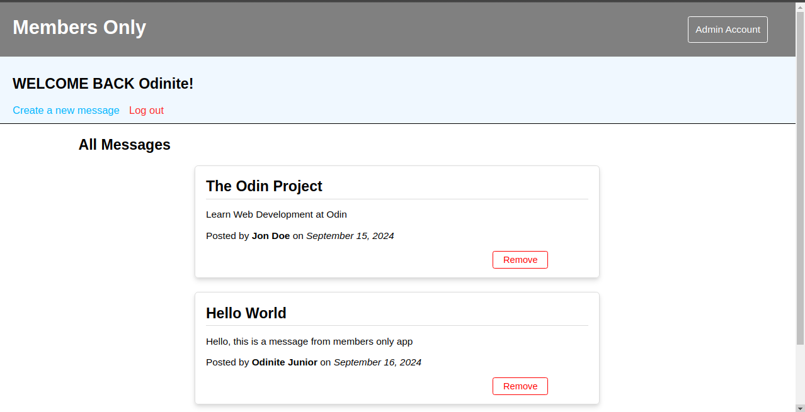

# Members Only Project

### Introduction

The **Members Only Project** is an exclusive online clubhouse where users can write anonymous posts. Only authenticated members with special privileges can see the identity of the post authors, while non-members can view the posts without knowing who wrote them. This project focuses on user authentication, role-based access control, and database management, and it’s part of The Odin Project’s NodeJS curriculum.



### Features

- **User Registration & Login:**
  - Users can sign up using their first name, last name, email and password.
  - Secure password storage using bcrypt for hashing.
  - Login is handled through Passport.js authentication middleware.
- **Member-Only Privileges:**

  - Users must input a secret passcode to gain exclusive membership status.
  - Members can view additional details about each post, including the author’s name and timestamp.

- **Post Creation & Viewing:**
  - Authenticated users can create posts with a title and body text.
  - Posts are viewable by all users, but only members can see the author and date.
- **Admin Access:**
  - Admins have special privileges, including the ability to delete posts.
  - Admin access is granted by entering an admin secret code or through manual promotion in the database.

### Installation

#### Live Demo

Check out the live version of the app: [Live Demo]()

#### Local Installation

To run the app locally, follow these steps:

1. **Clone the repository:**
   ```bash
   git clone https://github.com/odilson-dev/members-only-nodejs.git
   ```
2. **Install dependencies:**

```
   cd members-only-nodejs
   npm install
```

3. **Set up environment variables**

- Create a .env file in the root directory and add the following variables:
  bash
  Copy code

```bash
DATABASE_URL=your_postgresql_database_uri
ADMIN_ACCESS=your_admin_password
ACCESS_CODE=your_membership_access_code
```

- DATABASE_URL: Connection string for your PostgreSQL database.
- ADMIN_ACCESS: Password for admin-level access.
- ACCESS_CODE: Secret passcode required for users to become members.
- COOKIE_SECRET: A random string for securing session cookies.

### Usage

- **Signup/Login**: Create a user account and log in.
- **Join the Club**: Enter the secret passcode to gain membership.
- **Post Messages**: Authenticated users can post anonymously.
- **Admin Controls**: Admins can delete posts if they have admin privileges.

### Technologies Used

- **[Node.js](https://nodejs.org/)**: A runtime environment for executing JavaScript on the server-side.
- **[Express](https://expressjs.com/)**: A fast, unopinionated web framework for Node.js.
- **[PostgreSQL](https://www.postgresql.org/)**: An open-source relational database management system for storing user data and posts.
- **[Passport.js](https://www.passportjs.org/)**: Middleware for authentication with username and password.
- **[bcrypt](https://github.com/kelektiv/node.bcrypt.js)**: Library for hashing passwords.
- **[Express Validator](https://express-validator.github.io/)**: Middleware for validating and sanitizing user input.
- **[EJS](https://ejs.co/)**: Templating engine used to generate HTML markup with JavaScript.

### Conclusion

This project is part of [The Odin Project](https://www.theodinproject.com/), and you are free to use and modify the code.
